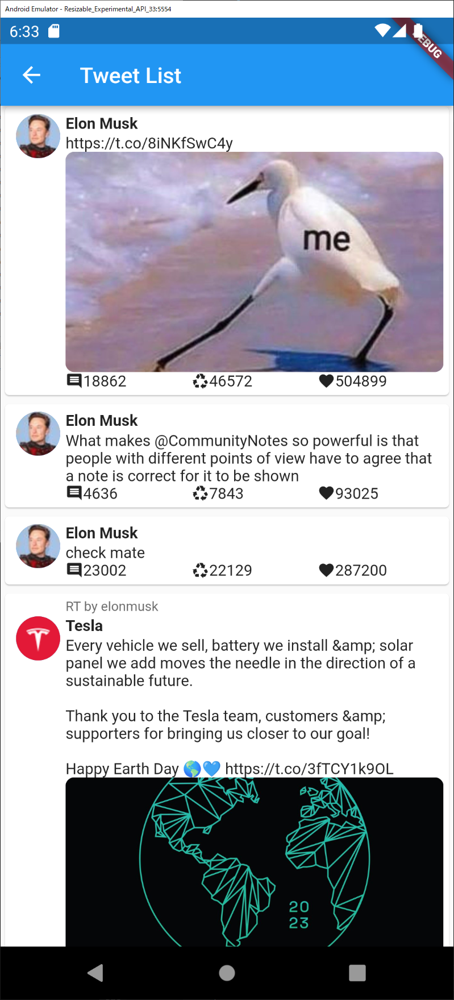

# flutter_example

## Login

### Login with Browser (Recommend/Mobile Only)

APIs can be executed.  
Webview implementation using [flutter_inappwebview](https://github.com/pichillilorenzo/flutter_inappwebview).  
The implementation is as follows.  

- [web.dart](./lib/view/login/web.dart)
- [inappwebview.dart](./lib/auth/inappwebview.dart)

```dart
final api = TwitterOpenapiDart()..addBeforInterceptor(FlutterInappwebviewDio());
final client = await api.getClient(initCookie: false);
```

### Login Guest Mode

Some APIs cannot be used because they run without login.  
The implementation is as follows.  

```dart
final api = TwitterOpenapiDart();
final client = await api.getClient();
```

## API Select

[api.dart](./lib/view/api/api.dart)

Since this application is a sample application, the function to specify information to be retrieved is not implemented, and information such as Elon Musk and BBC News will be retrieved.  


